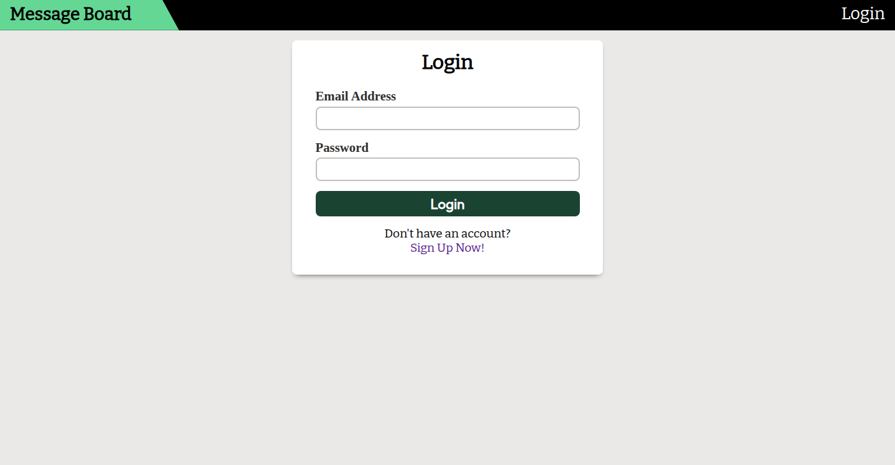
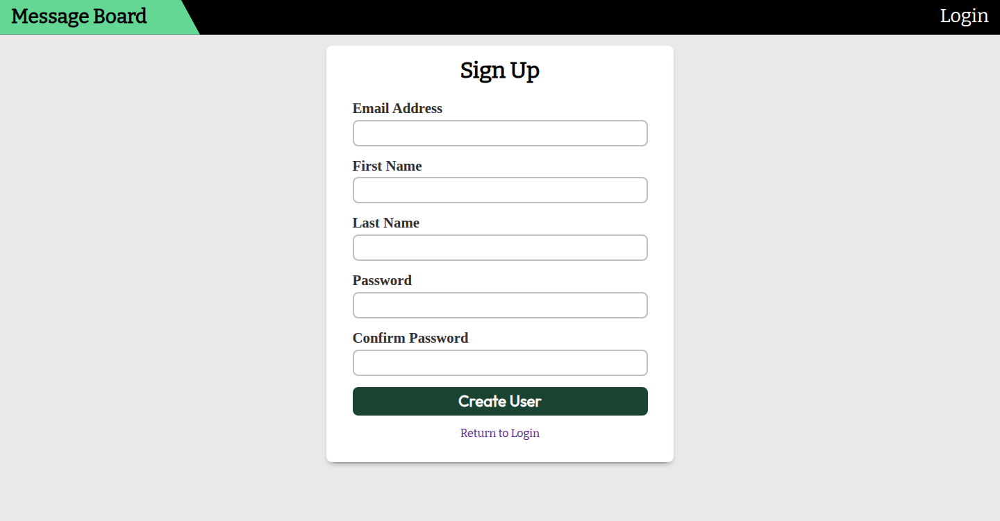
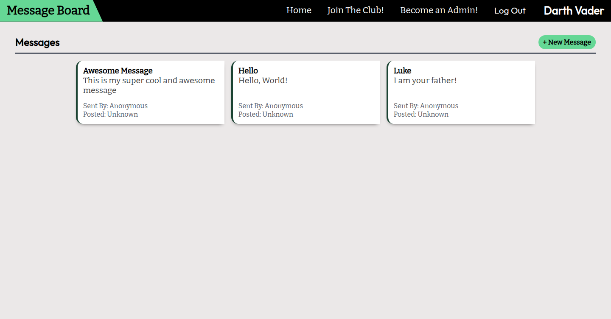
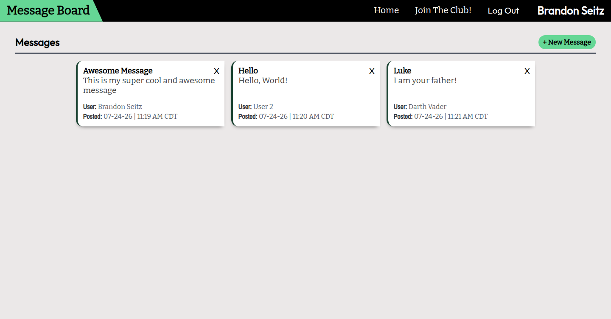
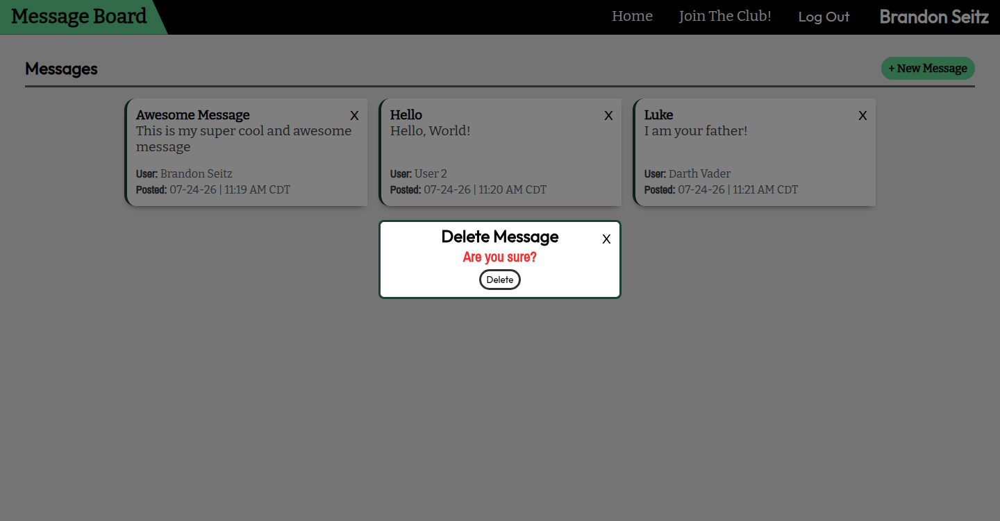

# Members Only

A full-stack application where users can view a message board with messages posted by other users and create messages of their own after logging in.

## Features

### Message Board

Displays all posted messages with the message content, author, and time each message was posted.

### Members and Admins

After creating an account and logging in, users can become either a member or an admin.

- Members can view the author and timestamp of each message.
- Admins have all member privileges and can also delete any message.

## Screenshots

### Authentication

**Login form**


**Signup Form**


### Message Board

**Messages board (guest view)**


**Messages board (Member/Admin view)**


### Membership and Admin

**Delele message as Admin**


## Technologies Used

### Frontend

- HTML
- CSS
- JavaScript
- EJS

### Backend

- Node.js
- Express
- Express Session
- PostgreSQL

### Prerequisites

- Node.js
- PostgreSQL
- npm

## Installation

1. Clone the repository

```bash
git clone https://github.com/Salypse/members-only.git
```

2. Install dependencies

```bash
npm install
```

3. Create .env file with the following variables

```bash
touch .env
```

```env
# .env

PORT = desired_port_number
CONNECTION_STRING = postgresql_db_connection_string
SESSION_SECRET = your_random_session_secret
MEMBERSHIP_PASSWORD = your_membership_password
ADMIN_PASSWORD = your_admin_password
```

4. Create db tables and start the application

```bash
npm run seed
npm run start
```

## Usage

### Creating a Message

1. Create an account and log in.
2. On the homepage, press the **New Message** button to open the message form.
3. Enter a title and message text, then press **Submit**.

## Members and Admins

1. After logging in, click either the **Join the Club** or **Become an Admin** buttons that appear in the navigation bar.
2. Enter the required admin or membership password.

### Perks

- **Members:** When viewing the message board, members can see the author and timestamp of all messages.
- **Admins:** On the homepage, admins have the same perks as members with the added ability to delete any posted message.
